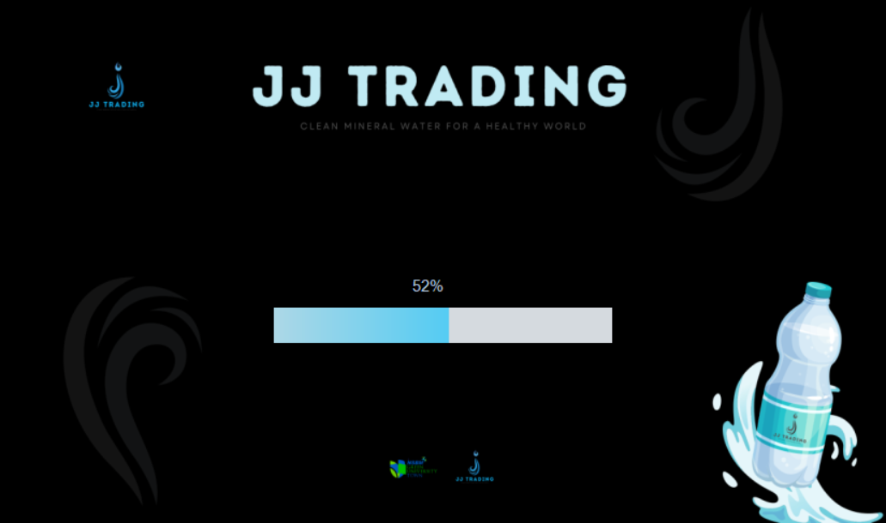

# JJ-BottleStock
Welcome to the Water Bottle Stock Management System repository for JJ Trading Company. This comprehensive system is designed to help JJ Tradings efficiently manage its inventory of water bottles, streamline operations, and ensure seamless customer service.

#  

 

## Background of organization 
JJ Trading, a small-scale water bottle distribution company in Homagama City, prioritizes meeting customer needs with discounted prices for various occasions. Currently, the company relies on manual processes for operations and lacks dedicated software for stock management. Despite this, JJ Trading is committed to providing efficient water bottle distribution services, aiming to build a reputation for quality service and customer satisfaction. To enhance operational efficiency and embrace technological advancements, the company plans to introduce an advanced database management system for stock and order management. This strategic move is anticipated to elevate service quality, boost customer satisfaction, and foster business growth in the competitive water bottle distribution market in Homagama City.

## Problem Definition
JJ Trading, an established market player, confronts significant challenges in its stock and order management. The manual stock counting and order processing methods contribute to time-consuming processes and errors. The lack of automation results in delays and potential mismatches in customer orders. The company struggles to obtain accurate predictions and analytical data, leading to stock-related issues like stockouts and overstocking. Limited storage space further complicates matters, causing disorganization and increased risks of stock loss. Addressing these challenges is imperative for JJ Trading to streamline operations, reduce errors, and improve the overall efficiency of its stock and order management processes.

## Solution
We propose developing an all-inclusive standalone application for JJ Trading to address its stock and order management challenges. Tailored to enhance operational efficiency and streamline processes, the solution is designed considering the company's limited resources, small-scale operations, and the preference for a single-computer setup. This application aims to provide a cost-effective and user-friendly solution for JJ Trading's specific needs as they navigate the early stages of the business industry.

1. Used software and frameworks:
* Visual Studio
* .Net Framework 4.8 
* SQL Server Studio
* Windows Support OS
* Guna Framework

2. Interfaces

>Loading

>Login

* “Role” decides whether the user should be redirected to the User dashboard or Super Admin dashboard. (“User” can be either “Super Admin” or a “Staff-User”)

